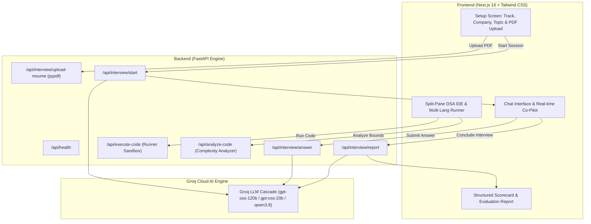

<div align="center">

# ⚡ AI Technical Interview Coach

[](https://groq.com)
[](https://nextjs.org)
[](https://fastapi.tiangolo.com)
[](https://python.org)
[](https://typescriptlang.org)
[](https://docker.com)
[](LICENSE)

**A real-world AI technical interview platform benchmarked against top tech engineering standards (Google, Meta, OpenAI, Stripe) with deep PDF resume cross-examination and an embedded multi-language DSA code execution sandbox.**

[Key Features](#-key-features) • [Architecture](#-architecture--interview-flow) • [Quickstart](#-local-development-setup) • [Deployment](#-cloud-deployment-vercel--render) • [API Reference](#-api-endpoints-reference)

---

</div>

## 📖 Overview

Link : https://ai-technical-interviewer-ashy.vercel.app/

The **AI Technical Interview Coach** simulates authentic technical interview loops conducted by Senior Staff Engineers and Bar Raisers at top tech firms. Unlike generic mock interview tools that output static textbook questions, this platform:

1. **Reasons in Real-Time via Groq Cloud LLMs**: Evaluates the candidate's exact technical responses, probes architectural trade-offs, and dynamically crafts spontaneous follow-ups.
2. **Deeply Parses PDF Resumes**: Extracts actual production systems, tools, and metrics to cross-examine candidates on what they personally engineered.
3. **Simulates 25+ Company Interview Bars**: Adapts its evaluation standards to specific company engineering philosophies (e.g. Google's Big-O rigor, Amazon's high-throughput trade-offs and Leadership Principles, Stripe's idempotency and double-entry accuracy, OpenAI's distributed model serving and KV-cache architectures).
4. **Combines Everything in a ⚡ Hybrid Track**: Evaluates the candidate's actual resume systems against the target company's real-world production scale.
5. **Provides a HackerRank/LeetCode Experience**: Built-in split-pane coding IDE supporting 7 programming languages with sandboxed code execution, test case assertions, and automated Big-O loophole detection.

---

## 🚀 Key Features

### 1. 🧠 High-Throughput Groq AI Reasoning Engine
- Powered by ultra-low latency Groq models (`openai/gpt-oss-120b`, `openai/gpt-oss-20b`, `qwen/qwen3.8-27b`) with automatic model fallback.
- **Adaptive Multi-Turn Flow**:
  - **Strong Answer**: Acknowledges in 1 concise line and advances to a different architectural dimension.
  - **Partially Correct Answer**: Asks a targeted probing follow-up without giving away the answer.
  - **Incorrect / Weak Answer**: Notes the gap in one concise, constructive line and smoothly pivots to the next question.

### 2. ⚡ Hybrid Track: Company Bar + Resume Tailoring
- When **both** a Company and a Resume are provided:
  - Adopts the persona of a **Lead Staff Engineer and Bar Raiser** at the selected company.
  - Cross-examines the candidate's actual resume projects under the company's real-world scale and failure modes.
  - Displays a dedicated glowing **Hybrid Interview Track Active** badge throughout the session.

### 3. 🌐 Authentic Company Question Bank (25+ Top Tech Companies)
- Integrated authentic interview pools for **Google, Meta, Amazon, Microsoft, Apple, Netflix, Uber, Bloomberg, ByteDance, Stripe, OpenAI, Nvidia, Databricks, Cisco, Atlassian, Spotify, Snowflake, DoorDash, Twitter / X, Palantir, Goldman Sachs, Adobe, Salesforce, and Airbnb**.
- **Dynamic Online Fetcher**: For any arbitrary startup or enterprise not in the static bank, Groq dynamically searches and synthesizes recent interview problems asked in 2024–2026 loops.

### 4. 📄 Deep PDF Resume Scanning
- Ingests PDF resumes via `pypdf` and advanced heuristic regex extractors.
- Automatically isolates **flagship projects, work history, programming languages, cloud architectures, and quantitative impact metrics**.
- Formulates multi-tiered questions directly examining database indexing, concurrency bottlenecks, API contracts, and CI/CD pipelines used in the candidate's past work.

### 5. 🧩 HackerRank-Grade DSA IDE & Multi-Language Sandbox
- Embedded code editor with syntax highlighting, starter code generation, and test case execution.
- **7 Supported Languages**: Python 3, JavaScript (Node.js), TypeScript, C++ 20, Java 21, Go 1.22, and Rust 1.76.
- **Run Code ▶**: Sandboxed test execution validating candidate algorithms against multiple test cases.
- **Loophole Finder**: Analyzes code for asymptotic time/space bounds ($O(N)$, $O(N \log N)$), edge cases (empty inputs, integer overflow, duplicate keys), and code quality.

### 6. 🔊 Instant Web Speech Audio & Responsive Controls
- Instant text-to-speech audio begins playing automatically from Question #1.
- One-click mute/unmute control that instantly cancels synthesis.
- Flexible session sizing: Choose between **5 to 20 questions** with real-time progress indicators.
- **Live Co-Pilot**: Real-time keyword tracker and structural frameworks (e.g. STAR method) to guide responses before submission.

### 7. 📊 Structured Diagnostic Evaluation Scorecard
- Generates a comprehensive JSON scorecard:
  - Overall Score (0–100) with Tier: **Excellent** (85+), **Good** (70–84), **Adequate** (55–69), or **Weak** (<55).
  - Explicit **Pass / Fail** verdict.
  - Evidence-backed **Strengths & Weaknesses** directly quoting the candidate's exact statements.
  - Dimension-by-dimension radar breakdown and actionable revision curriculum.

---

## 🏛️ Architecture & Interview Flow



---

## 🛠️ Tech Stack

| Component | Technology | Description |
| :--- | :--- | :--- |
| **Frontend Framework** | Next.js 16 (App Router) | High-performance React server components & client hydration |
| **Language** | TypeScript 5.x | Strict type safety across all interview models and components |
| **Styling** | Vanilla Tailwind CSS | Dark modern design with glassmorphism and responsive split-views |
| **Backend Framework** | FastAPI (Python 3.11+) | Asynchronous, concurrent REST API with automatic OpenAPI docs |
| **ASGI Server** | Uvicorn | Production multi-worker web server (`--workers 4`) |
| **AI Engine** | Groq Cloud API | High-throughput LLM reasoning with multi-model fallback |
| **Document Processing**| PyPDF + Heuristic Regex | In-memory text extraction, project and metric isolation |
| **Containerization** | Docker & Docker Compose | Multi-stage production container images |

---

## 💻 Local Development Setup

### Prerequisites
- **Node.js**: v18.0.0 or higher
- **Python**: v3.10 or higher
- **Groq API Key**: Obtain a free key from the [Groq Console](https://console.groq.com/keys)

---

### Step 1: Clone the Repository
```bash
git clone https://github.com/YOUR_USERNAME/ai-interviewer.git
cd ai-interviewer
```

---

### Step 2: Configure the Backend

1. Navigate to the backend directory:
   ```powershell
   cd backend
   ```

2. Create and activate a Python virtual environment:
   ```powershell
   # Windows PowerShell
   python -m venv venv
   .\venv\Scripts\Activate.ps1

   # macOS / Linux
   python3 -m venv venv
   source venv/bin/activate
   ```

3. Install backend dependencies:
   ```bash
   pip install -r requirements.txt
   ```

4. Create a `.env` file in `backend/`:
   ```env
   GROQ_API_KEY=your_groq_api_key_here
   ALLOWED_ORIGINS=http://localhost:3000
   ```

5. Start the FastAPI backend:
   ```powershell
   uvicorn main:app --reload --port 8000
   ```
   - API Base URL: `http://localhost:8000`
   - Swagger Documentation: `http://localhost:8000/docs`
   - Health Check: `http://localhost:8000/api/health`

---

### Step 3: Configure the Frontend

1. In a separate terminal, navigate to the frontend directory:
   ```bash
   cd frontend
   ```

2. Install Node dependencies:
   ```bash
   npm install
   ```

3. Start the Next.js development server:
   ```bash
   npm run dev
   ```

4. Open [http://localhost:3000](http://localhost:3000) in your browser.

---

## 🌐 Cloud Deployment (Vercel + Render)

The project is pre-configured for zero-error multi-tenant deployment using **Render** for the Python backend and **Vercel** for the Next.js frontend.

### 1. Deploy the Backend on [Render](https://render.com)
1. Push your repository to GitHub.
2. In the Render Dashboard, click **New +** > **Web Service** (or use the included `render.yaml` Blueprint).
3. Connect your repository and configure:
   - **Root Directory**: `backend`
   - **Runtime**: `Python 3`
   - **Build Command**: `pip install -r requirements.txt`
   - **Start Command**: `uvicorn main:app --host 0.0.0.0 --port $PORT`
4. Under the **Environment Variables** tab, add:
   - `GROQ_API_KEY`: `your_groq_api_key_here`
   - `ALLOWED_ORIGINS`: `*` (or your Vercel URL once deployed)
5. Click **Deploy Web Service** and copy your backend URL (e.g. `https://ai-interviewer-backend.onrender.com`).

---

### 2. Deploy the Frontend on [Vercel](https://vercel.com)
1. In Vercel, click **Add New...** > **Project** and select your GitHub repository.
2. Configure project settings:
   - **Root Directory**: Select `frontend`
   - **Framework Preset**: `Next.js`
3. Under **Environment Variables**, add:
   - `NEXT_PUBLIC_BACKEND_URL`: `https://ai-interviewer-backend.onrender.com` (your Render backend URL)
4. Click **Deploy**. Vercel will build and launch your production frontend!

---

## 🐳 Local Container Deployment (Docker Compose)

To run the entire platform locally in production-grade containers with 1 command:

```bash
docker-compose up --build -d
```

- **Frontend**: Available at `http://localhost:3000`
- **Backend**: Available at `http://localhost:8000`
- **Scale Workers**: To increase backend capacity for multiple concurrent users:
  ```bash
  docker-compose up --scale backend=3 -d
  ```

---

## 📡 API Endpoints Reference

| Method | Endpoint | Description |
| :--- | :--- | :--- |
| `GET` | `/api/health` | Service health check and engine readiness |
| `GET` | `/api/companies` | List all 25+ target companies with bar criteria and focus areas |
| `POST` | `/api/interview/upload-resume` | Upload PDF resume, extract text, projects, and metrics |
| `POST` | `/api/interview/start` | Initialize interview session, generate Question #1, and load starter snippets |
| `POST` | `/api/interview/answer` | Submit candidate response; returns adaptive evaluation and next question |
| `POST` | `/api/interview/hint` | Request on-demand progressive hint for the current problem |
| `POST` | `/api/interview/report` | Generate structured evaluation report and diagnostic scorecard |
| `POST` | `/api/execute-code` | Run candidate code in the execution sandbox against test cases |
| `POST` | `/api/analyze-code` | Analyze code for asymptotic complexity ($O$), loopholes, and edge cases |

---

## 🔒 Security & Privacy

- **Per-User Client Keys**: Users can supply their personal Groq API key directly in the frontend Settings modal. Keys stored in browser `localStorage` take precedence, allowing public hosting without consuming server API quotas.
- **Zero Key Leaks**: `.gitignore` ensures that all local `.env` files and virtual environments are never committed to version control.
- **Safe Code Execution**: Code execution endpoints run with strict timeouts and memory isolation.

---

## 📄 License

This project is licensed under the **MIT License**. See the [LICENSE](LICENSE) file for details.
